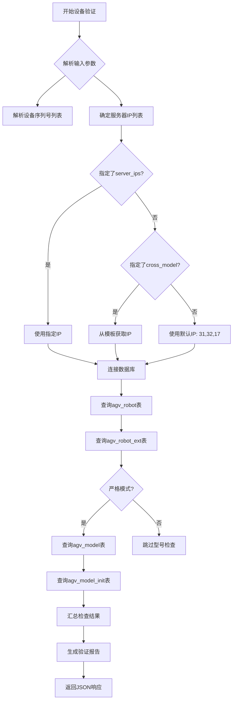

# AGV任务查询系统技术文档

## 1. 系统概述

AGV任务查询系统是一个现代化的跨环境任务管理与配置验证平台，提供任务查询、设备验证、配置检查等功能。系统采用前后端分离架构，前端为现代化HTML/CSS/JavaScript界面，后端为PHP处理业务逻辑和数据库操作。

### 1.1 主要功能
- 任务单号查询
- 跨环境任务模板查询
- 设备序列号验证
- 交接点查询
- 货架模型查询
- 货架查询
- 跨环境任务模板配置验证

### 1.2 技术栈
- **前端**: HTML5, CSS3, JavaScript (ES6+)
- **后端**: PHP 7.0+
- **数据库**: MySQL
- **网络协议**: HTTP/HTTPS
- **样式库**: Font Awesome 6.4.0

## 2. 系统架构

### 2.1 整体架构图

```
┌─────────────────────────────────────────────────────────────┐
│                    AGV任务查询系统架构                        │
├─────────────────────────────────────────────────────────────┤
│                                                             │
│  ┌─────────────┐    ┌─────────────┐    ┌─────────────┐    │
│  │   前端界面   │    │   PHP处理层  │    │  数据库层    │    │
│  │  index.html │    │  handlers/  │    │  MySQL      │    │
│  └──────┬──────┘    └──────┬──────┘    └──────┬──────┘    │
│         │                  │                   │           │
│         │ HTTP请求         │ SQL查询           │ 数据返回   │
│         ├─────────────────►├─────────────────►├──────────►│
│         │                  │                   │           │
│         │ JSON/HTML响应    │ 查询结果          │           │
│         ◄─────────────────◄◄─────────────────◄│           │
│                                                             │
└─────────────────────────────────────────────────────────────┘
```

### 2.2 目录结构

```
agv-task-query/
├── index.html                    # 主界面
├── includes/                     # 公共包含文件
│   ├── init.php                  # 初始化文件
│   ├── db-connection.php         # 数据库连接工具
│   ├── sql-helper.php            # SQL辅助函数
│   ├── json-helper.php           # JSON处理函数
│   ├── http-helper.php           # HTTP辅助函数
│   ├── form-helper.php           # 表单辅助函数
│   └── task-validator.php        # 任务验证器
├── handlers/task/                # 任务处理接口
│   ├── find-task.php             # 任务查询
│   ├── find-cross-task.php       # 跨环境任务查询
│   ├── check-cross-model.php     # 跨环境模型检查
│   ├── validate-device.php       # 设备验证
│   ├── validate-config.php       # 配置验证
│   ├── query-join-point.php      # 交接点查询
│   ├── query-shelf-model.php     # 货架模型查询
│   ├── query-shelf.php           # 货架查询
│   ├── query-cross-model.php     # 跨环境模型查询
│   └── cross-task-query.php      # 跨环境任务查询
├── docs/                         # 文档目录
│   └── AGV任务查询系统技术文档.md  # 本技术文档
├── tests/                        # 测试文件
│   └── test-validator.php        # 验证器测试
└── exports/                      # 导出功能
    └── export-robot-data.php     # 机器人数据导出
```

## 3. 前端界面设计

### 3.1 页面布局

采用左右分栏设计：
- **左侧面板 (45%)**: 功能表单区域，包含8个主要功能模块
- **右侧面板 (55%)**: 结果显示区域，使用iframe加载查询结果

### 3.2 主题系统

支持亮色/暗黑双主题模式：
- **亮色主题**: 浅色背景，深色文字
- **暗黑主题**: 深色背景，浅色文字
- 主题切换通过CSS变量实现
- 用户偏好保存在localStorage中

### 3.3 响应式设计

支持移动端适配：
- 1024px以下切换为上下布局
- 表单元素自适应宽度
- 触摸友好的交互设计

## 4. 接口规范

### 4.1 通用接口规范

所有接口遵循以下规范：
- 请求方式: GET
- 响应格式: JSON 或 HTML
- 字符编码: UTF-8
- 错误处理: HTTP状态码 + JSON错误信息

### 4.2 接口列表

#### 4.2.1 任务查询接口

**接口**: `handlers/task/find-task.php`

**请求参数**:
```http
GET /handlers/task/find-task.php?idd=TASK2025001&RCSip=31
```

| 参数名 | 类型 | 必填 | 说明 |
|--------|------|------|------|
| idd | string | 是 | 任务单号 |
| RCSip | string | 是 | 服务器IP后缀 |

**响应示例** (HTML格式):
```html
<div class='info-item'><span class='info-label'>输入的任务ID：</span><span class='info-value'>TASK2025001</span></div>
<div class='info-item success'>数据库连接成功：10.68.2.31</div>
<div class='info-item'><span class='info-label'>所在区域id：</span><span class='info-value'>1001</span></div>
...
```

#### 4.2.2 设备验证接口

**接口**: `handlers/task/validate-device.php`

**请求参数**:
```http
GET /handlers/task/validate-device.php?device_codes=BM20389BAK00001,BM20389BAK00003&cross_model=XJBYHK_19XHX3F_to_17XHX2F_428&server_ips=31,32,17&strict=true
```

| 参数名 | 类型 | 必填 | 说明 |
|--------|------|------|------|
| device_codes | string | 是 | 设备序列号，逗号分隔 |
| cross_model | string | 否 | 跨环境大任务模板 |
| server_ips | string | 否 | 指定服务器IP后缀，逗号分隔 |
| strict | boolean | 否 | 严格模式，默认false |

**响应示例** (JSON格式):
```json
{
  "device_codes": ["BM20389BAK00001", "BM20389BAK00003"],
  "cross_model": "XJBYHK_19XHX3F_to_17XHX2F_428",
  "server_ips": ["31", "32", "17"],
  "strict_mode": true,
  "overall_status": "complete",
  "environment_checks": {
    "31": {
      "status": "complete",
      "message": "设备配置查询完成",
      "missing": [],
      "details": [...],
      "tables_summary": {
        "agv_robot": "2 条记录",
        "agv_robot_ext": "2 条记录",
        "agv_model": "1 条记录",
        "agv_model_init": "表不存在或查询失败"
      }
    }
  },
  "missing_configs": [],
  "suggestions": ["所有设备配置完整，跨环境一致性良好。"]
}
```

#### 4.2.3 货架查询接口

**接口**: `handlers/task/query-shelf.php`

**请求参数**:
```http
GET /handlers/task/query-shelf.php?shelf_codes=HX001-HX010&cross_model=XJBYHK_...&server_ips=31,32,17
```

| 参数名 | 类型 | 必填 | 说明 |
|--------|------|------|------|
| shelf_codes | string | 是 | 货架编号，支持范围如HX001-HX010 |
| cross_model | string | 否 | 跨环境大任务模板 |
| server_ips | string | 否 | 指定服务器IP后缀 |

**响应示例**:
```json
{
  "query": {
    "shelf_codes": ["HX001", "HX002", ..., "HX010"],
    "cross_model": "XJBYHK_...",
    "server_ips": ["31", "32", "17"]
  },
  "results": {
    "31": [
      {"shelf_code": "HX001", "shelf_type": "A", "area_id": "1001", "enable": "1"},
      {"shelf_code": "HX002", "shelf_type": "A", "area_id": "1001", "enable": "1"}
    ],
    "32": [...],
    "17": [...]
  },
  "consistency_check": {
    "consistent": true,
    "inconsistent_shelves": []
  },
  "suggestions": []
}
```

#### 4.2.4 跨环境任务模板查询接口

**接口**: `handlers/task/query-cross-model.php`

**请求参数**:
```http
GET /handlers/task/query-cross-model.php?id=428
# 或
GET /handlers/task/query-cross-model.php?code=XJBYHK_19XHX3F_to_17XHX2F_428
# 或
GET /handlers/task/query-cross-model.php?name=下架搬运回库_19新华消3F_to_172F_428
```

| 参数名 | 类型 | 必填 | 说明 |
|--------|------|------|------|
| id | integer | 否 | 模板ID |
| code | string | 否 | 模板编号 |
| name | string | 否 | 模板名称 |
| identifier | string | 否 | 通用标识符 |

**响应格式**: HTML格式，包含三个部分：
1. 主表配置 (fy_cross_model_process)
2. 子表配置 (fy_cross_model_process_detail)
3. 正在执行的任务 (fy_cross_task)

## 5. 数据库设计

### 5.1 数据库连接配置

系统使用统一的数据库连接配置：
- **主机**: `10.68.2.{ip_suffix}`
- **用户名**: `wms`
- **密码**: `CCshenda889`
- **数据库**: `wms`
- **字符集**: `utf8`

### 5.2 主要数据表

#### 5.2.1 任务相关表

**task_group** - 任务组表
```sql
CREATE TABLE task_group (
    id INT PRIMARY KEY,
    third_order_id VARCHAR(50),      -- 第三方订单ID
    area_id INT,                     -- 区域ID
    template_code VARCHAR(100),      -- 任务模板代码
    robot_num VARCHAR(50),           -- 机器人编号
    robot_id VARCHAR(50),            -- 机器人ID
    robot_type VARCHAR(50),          -- 机器人类型
    shelf_model VARCHAR(50),         -- 货架模型
    carrier_code VARCHAR(50),        -- 载体代码
    path_points TEXT,                -- 路径点集
    error_desc TEXT,                 -- 错误描述
    status INT,                      -- 任务状态
    create_time BIGINT,              -- 创建时间
    start_time BIGINT,               -- 开始时间
    end_time BIGINT,                 -- 结束时间
    order_id VARCHAR(50),            -- 订单ID
    out_order_id VARCHAR(50)         -- 外部订单ID
);
```

**task_status_config** - 任务状态配置表
```sql
CREATE TABLE task_status_config (
    task_status INT PRIMARY KEY,
    task_status_name VARCHAR(100)
);
```

#### 5.2.2 设备相关表

**agv_robot** - AGV机器人表
```sql
CREATE TABLE agv_robot (
    ID INT PRIMARY KEY,
    DEVICE_CODE VARCHAR(50),         -- 设备序列号
    DEVICE_IP VARCHAR(20),           -- 设备IP
    DEVICETYPE VARCHAR(50),          -- 设备型号
    -- 其他字段...
);
```

**agv_robot_ext** - AGV机器人扩展表
```sql
CREATE TABLE agv_robot_ext (
    id INT PRIMARY KEY,
    device_code VARCHAR(50),         -- 设备序列号
    -- 其他扩展字段...
);
```

**agv_model** - AGV型号表
```sql
CREATE TABLE agv_model (
    SERIES_MODEL_NAME VARCHAR(100) PRIMARY KEY,
    -- 其他型号相关字段...
);
```

**agv_model_init** - AGV型号初始化表
```sql
CREATE TABLE agv_model_init (
    SERIES_MODEL_NAME VARCHAR(100) PRIMARY KEY,
    -- 初始化配置字段...
);
```

#### 5.2.3 跨环境任务表

**fy_cross_model_process** - 跨环境模型流程表
```sql
CREATE TABLE fy_cross_model_process (
    id INT PRIMARY KEY,
    model_process_code VARCHAR(100),  -- 模型流程代码
    model_process_name VARCHAR(200),  -- 模型流程名称
    -- 其他流程配置字段...
);
```

**fy_cross_model_process_detail** - 跨环境模型流程详情表
```sql
CREATE TABLE fy_cross_model_process_detail (
    id INT PRIMARY KEY,
    model_process_id INT,             -- 模型流程ID
    task_servicec VARCHAR(500),       -- 任务服务URL
    -- 其他详情字段...
);
```

**fy_cross_task** - 跨环境任务表
```sql
CREATE TABLE fy_cross_task (
    id INT PRIMARY KEY,
    model_process_code VARCHAR(100),  -- 模型流程代码
    task_status INT,                  -- 任务状态
    -- 其他任务字段...
);
```

#### 5.2.4 货架相关表

**shelf_config** - 货架配置表
```sql
CREATE TABLE shelf_config (
    shelf_code VARCHAR(50) PRIMARY KEY,
    shelf_type VARCHAR(20),           -- 货架类型
    area_id INT,                      -- 区域ID
    enable TINYINT                    -- 启用状态
);
```

**load_config** - 负载配置表
```sql
CREATE TABLE load_config (
    model VARCHAR(50) PRIMARY KEY,
    name VARCHAR(100)                 -- 配置名称
);
```

### 5.3 数据库查询示例

#### 5.3.1 任务查询SQL
```sql
-- 根据任务单号查询任务
SELECT * FROM task_group WHERE third_order_id = 'TASK2025001';

-- 查询设备IP
SELECT DEVICE_IP FROM agv_robot WHERE DEVICE_CODE = '设备序列号';

-- 查询货架模型名称
SELECT name FROM load_config WHERE model = '货架模型编号';

-- 查询任务状态名称
SELECT task_status_name FROM task_status_config WHERE task_status = 状态值;
```

#### 5.3.2 设备验证SQL
```sql
-- 查询设备基本信息
SELECT * FROM agv_robot WHERE device_code IN ('BM20389BAK00001', 'BM20389BAK00003');

-- 查询设备扩展信息
SELECT * FROM agv_robot_ext WHERE device_code IN ('BM20389BAK00001', 'BM20389BAK00003');

-- 查询设备型号信息
SELECT * FROM agv_model WHERE SERIES_MODEL_NAME IN ('型号1', '型号2');

-- 查询设备型号初始化信息
SELECT * FROM agv_model_init WHERE SERIES_MODEL_NAME IN ('型号1', '型号2');
```

#### 5.3.3 跨环境模板查询SQL
```sql
-- 查询主模板信息
SELECT * FROM fy_cross_model_process 
WHERE id = 428 
   OR model_process_code = 'XJBYHK_19XHX3F_to_17XHX2F_428'
   OR model_process_name = '下架搬运回库_19新华消3F_to_172F_428';

-- 查询子任务配置
SELECT * FROM fy_cross_model_process_detail WHERE model_process_id = 428;

-- 查询正在执行的任务
SELECT * FROM fy_cross_task 
WHERE model_process_code = 'XJBYHK_19XHX3F_to_17XHX2F_428' 
  AND task_status IN (0,1,6,4,9,10);
```

## 6. 核心业务逻辑

### 6.1 设备验证流程



### 6.2 跨环境一致性检查

系统支持跨多个服务器环境的一致性检查：
1. **设备配置一致性**: 检查设备在各环境中的配置是否一致
2. **货架类型一致性**: 检查货架类型在各环境中的一致性
3. **任务模板一致性**: 检查任务模板在各环境中的配置

### 6.3 错误处理机制

#### 6.3.1 数据库连接错误
```php
if (!$conn) {
    http_response_code(500);
    echo json_encode(['error' => '数据库连接失败: ' . mysqli_connect_error()], JSON_UNESCAPED_UNICODE);
    exit;
}
```

#### 6.3.2 参数验证错误
```php
if (empty($deviceCodesStr)) {
    http_response_code(400);
    echo json_encode(['error' => '缺少必要参数 device_codes'], JSON_UNESCAPED_UNICODE);
    exit;
}
```

#### 6.3.3 查询错误
```php
if (!$retval) {
    die('<div class="error">无法读取数据: ' . mysqli_error($conn) . '</div>');
}
```

## 7. 前端JavaScript逻辑

### 7.1 主题切换
```javascript
const themeToggle = document.getElementById('themeToggle');
themeToggle.addEventListener('click', () => {
    const isDark = document.documentElement.classList.toggle('dark-mode');
    localStorage.setItem('theme', isDark ? 'dark' : 'light');
    // 更新图标和文本
});
```

### 7.2 结果可视化
系统自动检测iframe中的JSON数据并转换为表格显示：

```javascript
function jsonToTable(json) {
    if (!json || typeof json !== 'object') return '<p>无法解析数据</p>';
    
    let html = '<div style="padding: 20px;">';
    if (Array.isArray(json)) {
        // 数组处理逻辑
        html += '<table border="1" cellspacing="0" cellpadding="8">';
        // 生成表头和行
        html += '</table>';
    } else {
        // 对象处理逻辑
        html += '<table border="1" cellspacing="0" cellpadding="8">';
        for (const key in json) {
            html += `<tr><td>${key}</td><td>${json[key]}</td></tr>`;
        }
        html += '</table>';
    }
    html += '</div>';
    return html;
}
```

### 7.3 表单验证
前端进行基本的表单验证：
- 必填字段检查
- 格式验证（如IP地址格式）
- 范围验证（如货架编号范围）

## 8. 部署与配置

### 8.1 环境要求
- PHP 7.0+
- MySQL 5.6+
- Web服务器（Apache/Nginx）
- 支持JavaScript的现代浏览器

### 8.2 配置文件
系统使用统一的数据库连接配置，位于`includes/db-connection.php`：
```php
$dbuser = 'wms';
$dbpass = 'CCshenda889';
```

### 8.3 安全考虑
1. **SQL注入防护**: 使用`mysqli_real_escape_string()`和参数化查询
2. **XSS防护**: 使用`htmlspecialchars()`输出用户输入
3. **输入验证**: 对所有输入参数进行验证和清理
4. **错误处理**: 生产环境应关闭错误显示

## 9. 测试与验证

### 9.1 测试用例

#### 9.1.1 设备验证测试
```php
// 测试正常情况
$deviceCodes = 'BM20389BAK00001,BM20389BAK00003';
$serverIps = '31,32,17';
$strict = 'true';

// 测试异常情况
$emptyDeviceCodes = '';
$invalidServerIps = '999';
```

#### 9.1.2 任务查询测试
```php
// 测试存在的任务
$taskId = 'TASK2025001';
$serverIp = '31';

// 测试不存在的任务
$nonExistentTaskId = 'TASK9999999';
```

### 9.2 性能考虑
1. **数据库连接池**: 复用数据库连接
2. **查询优化**: 使用索引和合适的查询条件
3. **结果缓存**: 对频繁查询的结果进行缓存
4. **分页处理**: 大数据量查询使用分页

## 10. 维护与扩展

### 10.1 添加新功能
1. 在`handlers/task/`目录下创建新的PHP处理文件
2. 在`index.html`中添加对应的表单
3. 更新文档和测试用例

### 10.2 数据库扩展
1. 添加新的数据表时，更新数据库设计文档
2. 创建相应的查询函数
3. 更新相关的验证逻辑

### 10.3 监控与日志
建议添加：
1. 操作日志记录
2. 性能监控
3. 错误报警机制

---

## 附录A: 常见问题排查

### A.1 数据库连接失败
1. 检查网络连通性
2. 验证数据库凭据
3. 检查防火墙设置
4. 确认数据库服务运行状态

### A.2 查询结果为空
1. 验证查询条件是否正确
2. 检查数据是否存在
3. 确认数据库权限
4. 检查字符编码设置

### A.3 界面显示异常
1. 检查浏览器控制台错误
2. 验证CSS/JavaScript文件加载
3. 检查网络请求状态
4. 清除浏览器缓存

## 附录B: API响应状态码

| 状态码 | 说明 |
|--------|------|
| 200 | 请求成功 |
| 400 | 请求参数错误 |
| 404 | 资源未找到 |
| 500 | 服务器内部错误 |
| 503 | 服务不可用 |

## 附录C: 数据库字段说明

### C.1 task_group表字段说明
- `third_order_id`: 第三方系统传入的任务ID
- `robot_id`: 设备序列号，对应agv_robot表的DEVICE_CODE
- `shelf_model`: 货架模型编号，对应load_config表的model
- `status`: 任务状态，对应task_status_config表的task_status

### C.2 跨环境任务状态
- `0`: 待执行
- `1`: 执行中
- `4`: 暂停
- `6`: 等待
- `9`: 完成
- `10`: 取消

---

*文档版本: 1.0*
*最后更新: 2026-04-17*
*维护团队: AGV系统开发组*