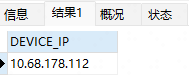

# AGV任务查询系统

基于PHP的AGV任务查询与监控系统，支持多服务器任务查询、跨环境任务管理、设备状态监控和数据导出。

## 功能特性

### 1. 任务查询
- **单任务查询**: 根据任务单号查询具体任务详情
- **跨环境任务查询**: 查询跨服务器任务模板和执行状态
- **跨环境任务详细查询**: 查看跨环境任务的子任务详情和执行统计

### 2. AGV设备监控
- **实时状态查询**: 通过RCS API获取AGV设备实时状态
- **区域过滤**: 按区域筛选设备显示
- **状态分类**: 空闲、忙碌、充电、故障等状态可视化

### 3. 数据导出
- **CSV导出**: 导出设备信息为CSV格式
- **多服务器支持**: 支持单服务器、多服务器或自定义服务器列表导出
- **UTF-8编码**: 完美支持中文Excel显示

### 4. 文档管理
- 系统说明文档
- 界面截图
- 使用指南

## 目录结构

```
agv-task-query/
├── index.html              # 主页面
├── agv-status.php          # AGV状态显示页面
├── includes/               # 公共库文件
│   ├── init.php           # 初始化文件（包含所有依赖）
│   ├── db-connection.php  # 数据库连接函数
│   ├── sql-helper.php     # SQL查询辅助函数
│   ├── http-helper.php    # HTTP请求辅助函数
│   ├── form-helper.php    # HTML表单生成函数
│   └── json-helper.php    # JSON处理函数
├── handlers/task/          # 任务处理程序
│   ├── find-task.php              # 单任务查询
│   ├── cross-task-query.php       # 跨环境任务查询
│   ├── check-cross-model.php      # 检查跨环境任务模板
│   └── find-cross-task.php        # 跨环境任务详细查询
├── exports/                # 数据导出
│   └── export-robot-data.php      # CSV导出功能
├── docs/                   # 文档
│   ├── README.md           # 本文件
│   └── images/             # 图片资源
└── tests/                  # 测试文件（待添加）
```

## 技术栈

- **后端**: PHP 7.0+
- **数据库**: MySQL (mysqli驱动)
- **前端**: HTML5, CSS3, JavaScript (基础)
- **网络**: cURL HTTP请求，JSON API交互
- **编码**: UTF-8全面支持

## 数据库连接

系统支持连接到多个RCS服务器的MySQL数据库，默认IP范围：`10.68.2.19-33`。

### 核心函数
- `connectMsqlAgvWms($ip)` - 连接指定服务器并显示连接信息
- `connectMsqlAgvWmsNoINFO($ip)` - 静默连接（不显示错误）
- `showdownMysqlNoINFO()` - 关闭数据库连接

## 接口说明

### RCS API端点
```
POST http://10.68.2.{IP}:{PORT}/service/app/getAgvStatus
Content-Type: application/json
```

请求体示例：
```json
{
    "area": "2",
    "robotType": "100001"
}
```

## 使用示例

### 1. 查询单个任务
1. 访问 `index.html`
2. 在"按照任务单号查询"表单中输入任务单号和服务器IP
3. 提交后显示任务详情

### 2. 监控AGV状态
1. 访问 `agv-status.php`
2. 可修改服务器IP后缀和区域ID
3. 显示该区域所有AGV设备的实时状态

### 3. 导出设备数据
直接访问导出链接：
- 单服务器: `exports/export-robot-data.php?mode=single&ip=31`
- 所有服务器: `exports/export-robot-data.php?mode=all`
- 自定义服务器: `exports/export-robot-data.php?mode=custom&servers=19,31,33`

## 安装部署

### 环境要求
- PHP 7.0+ (开启mysqli、curl扩展)
- MySQL客户端库
- Web服务器 (Apache/Nginx/IIS)

### 配置步骤
1. 将项目复制到Web目录
2. 确保PHP环境配置正确
3. 检查数据库连接参数（在`includes/db-connection.php`中）
4. 访问 `index.html` 开始使用

## 项目历史

本项目基于原 `projects/agv_system/app/2.1/` 目录重构而来，主要改进包括：

### 改进点
- **目录结构优化**: 层级清晰，模块化组织
- **命名规范化**: 中文文件/目录名改为英文
- **代码重构**: 统一函数库，消除重复代码
- **UI美化**: 增加CSS样式，提升用户体验
- **功能完整性**: 保留所有原功能并增强

### 文件对应关系
| 原文件 | 新文件 |
|--------|--------|
| `home.html` | `index.html` |
| `getheAGVINFOall.php` | `agv-status.php` |
| `Command/FindTheTask.php` | `handlers/task/find-task.php` |
| `Command/Kua.php` | `handlers/task/cross-task-query.php` |
| `Command/Chech_Kua_model_process.php` | `handlers/task/check-cross-model.php` |
| `Command/FindTheTaskKua.php` | `handlers/task/find-cross-task.php` |
| `导出为csv/` | `exports/` |
| `说明文档readme/` | `docs/` |

## 界面截图


*系统主界面*


*任务查询结果显示*

## 维护说明

### 添加新功能
1. 在 `includes/` 中添加相关辅助函数
2. 在 `handlers/` 中创建处理程序
3. 在 `index.html` 中添加对应的表单或链接
4. 更新 `docs/README.md` 文档

### 调试模式
在 `includes/init.php` 中设置 `$debug = true` 可启用调试信息显示。

### 错误处理
系统使用PHP错误日志记录错误，在生产环境中建议配置PHP日志文件。

## 许可证

内部使用，版权所有。

## 联系方式

如有问题请联系系统管理员。