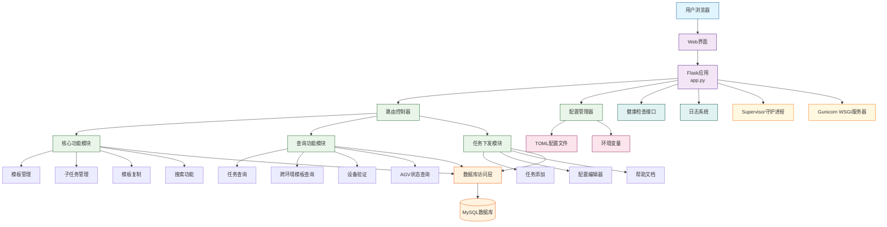
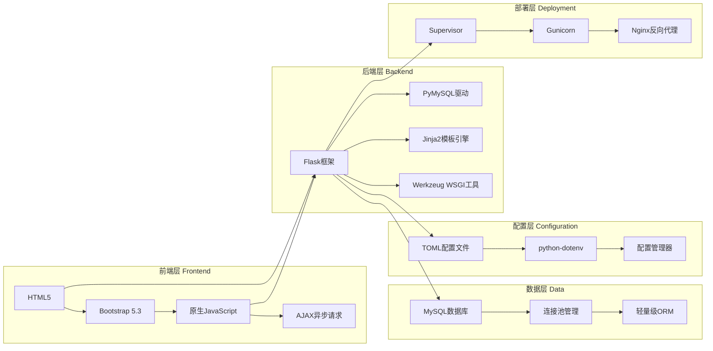
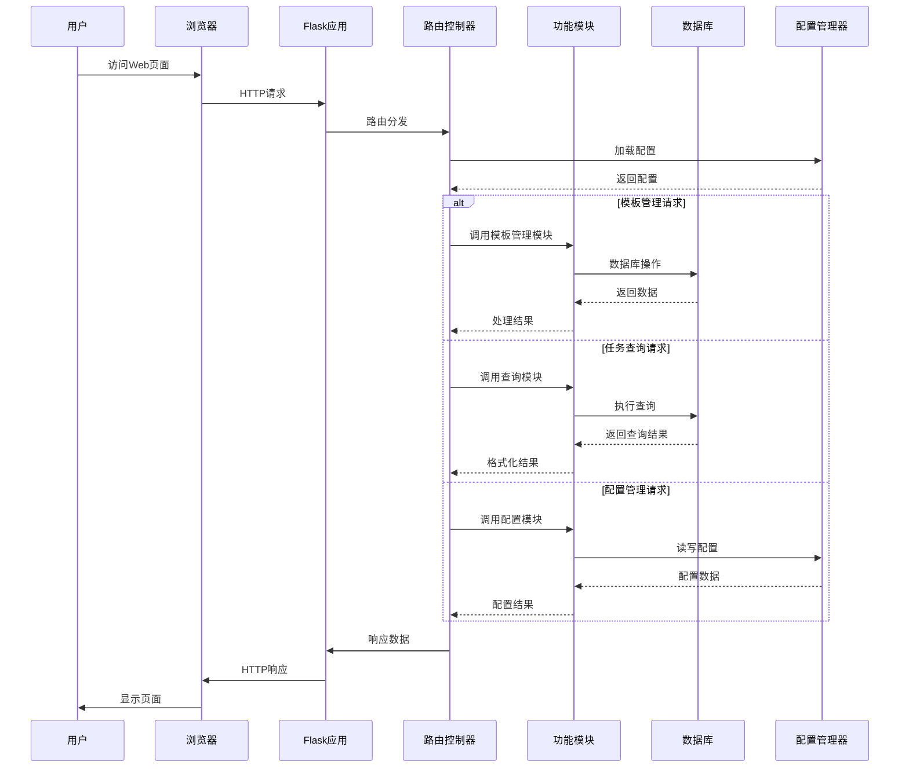
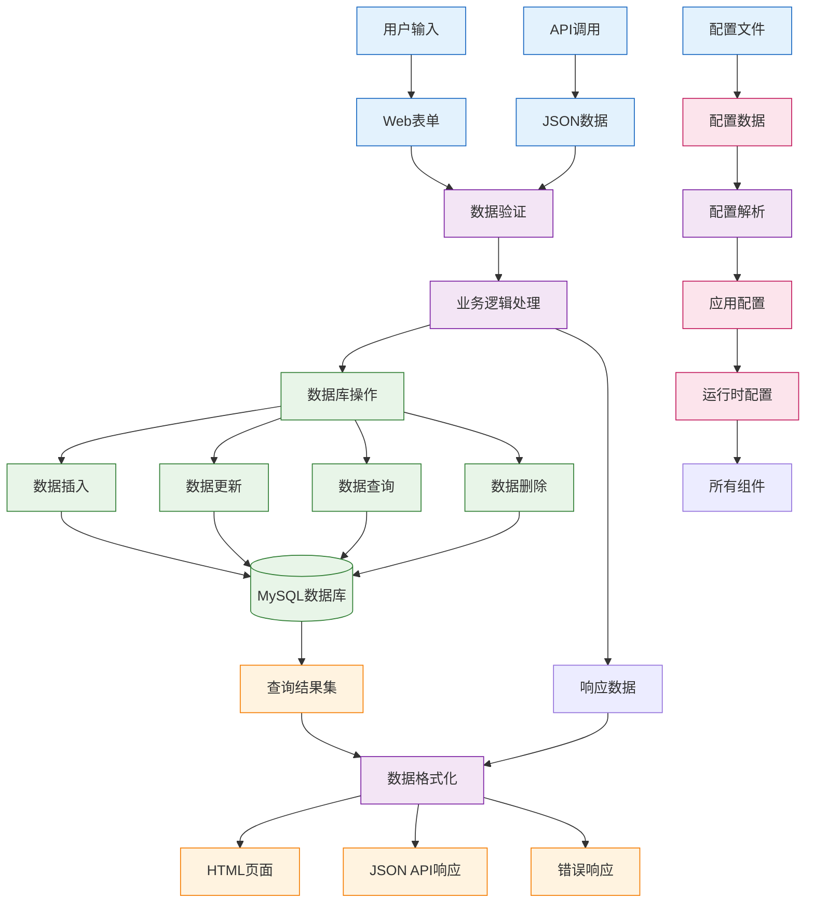
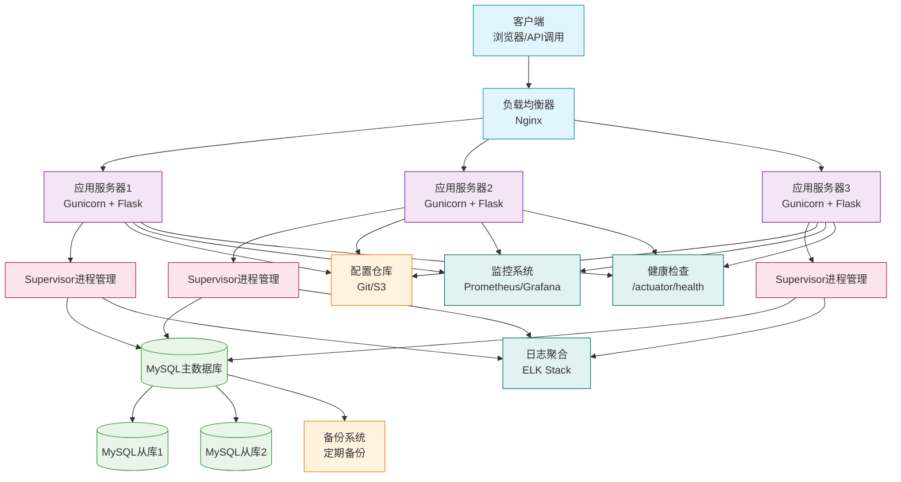

# 跨环境任务模板管理系统

基于Python Flask的Web应用，用于管理AGV跨环境任务模板。支持查询、修改、复制跨环境任务模板及其子任务。

## 功能特性

- 🔍 **智能搜索**: 支持模糊搜索任务模板代码和名称
- 📋 **模板详情查看**: 显示模板完整信息及子任务列表
- ✏️ **模板编辑**: 修改模板配置信息
- 📝 **子任务管理**: 编辑子任务详细信息
- 📋 **模板复制**: 基于现有模板创建新模板，自动生成ID后缀
- 🎨 **用户友好界面**: 响应式设计，操作直观
- 📊 **数据可视化**: 清晰的表格和卡片展示

## 系统要求

- Python 3.8+
- MySQL 5.7+
- 现代浏览器 (Chrome, Firefox, Edge等)

## 安装部署

### 部署脚本

 **IRAYPLEOS专用**: `./deploy_iraypleos.sh` - 专为IRAYPLEOS系统环境设计，一键部署


### 推荐部署方式

#### 使用主部署脚本（iraypleos离线部署）
该脚本基于 python3.9.9 以及 server/supervisor 离线部署
```bash
cd cross_env_manager/deploy_iraypleos
chmod +x deploy_iraypleos.sh
./deploy_iraypleos.sh
```

#### 1. 手动部署（备用方案）

### 2. 创建虚拟环境

```bash
python -m venv venv
source venv/bin/activate  # Linux/Mac
# 或
venv\Scripts\activate  # Windows
```

### 3. 安装依赖

```bash
pip install -r requirements.txt
```

### 4. 数据库配置

#### 创建测试数据库

```sql
CREATE DATABASE agv_cross_env_test;
USE agv_cross_env_test;

-- 创建表结构 (表结构已包含在app.py的初始化中)
-- 运行应用时会自动创建表
```

#### 修改数据库配置

编辑 `app.py` 中的 `DB_CONFIG` 部分：

```python
DB_CONFIG = {
    'host': 'localhost',
    'user': 'your_username',  # 修改为你的MySQL用户名
    'password': 'your_password',  # 修改为你的MySQL密码
    'database': 'agv_cross_env_test',
    'charset': 'utf8mb4'
}
```

### 5. 运行应用

```bash
python app.py
```

应用将在 `http://0.0.0.0:5000` 启动。

## 使用说明

### 1. 搜索模板

在首页搜索框中输入任务模板代码或名称：
- 输入 `HJBY` 查找所有包含HJBY的任务模板
- 输入完整代码如 `HJBY_back_32A3DJ2F_to_31A3QD4B3F_446`
- 支持模糊搜索，输入部分关键词即可

### 2. 查看模板详情

点击搜索结果中的"查看详情"按钮，显示：
- 模板基本信息
- 服务器配置
- 回流配置
- 子任务列表

### 3. 编辑模板

在模板详情页面点击"编辑模板"按钮：
- 修改模板名称、状态、容量管控等
- 更新服务器配置
- 修改回流参数
- 保存前需要确认

### 4. 复制模板

在模板详情页面点击"复制模板"按钮：
- 输入新模板的基础名称（不要包含ID后缀）
- 系统自动生成新ID（如：输入`HJBY_test`，最后ID为484，则生成`HJBY_test_485`）
- 继承原模板的所有配置和子任务

### 5. 编辑子任务

在模板详情页面点击子任务的编辑按钮：
- 修改任务顺序、模板代码、名称等
- 更新服务器地址和目标点
- 单独保存每个子任务

## 数据库表结构

### fy_cross_model_process (跨环境任务模板主表)
| 字段 | 类型 | 说明 |
|------|------|------|
| id | INT | 主键ID |
| model_process_code | VARCHAR(100) | 模板代码 (如 HJBY_back_32A3DJ2F_to_31A3QD4B3F_446) |
| model_process_name | VARCHAR(255) | 模板名称 |
| enable | TINYINT | 是否启用 (0=禁用/跨环境任务, 1=启用) |
| request_url | VARCHAR(500) | 回调URL |
| capacity | INT | 容量管控值 (-1表示不限制) |
| target_points | VARCHAR(100) | 目标点位 |
| area_id | INT | 区域ID |
| target_points_ip | VARCHAR(100) | 目标服务器IP |
| backflow_template_code | VARCHAR(100) | 货架回流任务模板 |
| comeback_template_code | VARCHAR(100) | 空车回流任务模板 |
| change_charge_template_code | VARCHAR(100) | 换电新车出发的任务模板 |
| min_power | INT | 换电任务触发电量 (%) |
| back_wait_time | INT | 空车回流触发等待时长 (秒) |
| check_area_name | VARCHAR(100) | 检查回流的片区域编号 |

### fy_cross_model_process_detail (跨环境子任务模板明细表)
| 字段 | 类型 | 说明 |
|------|------|------|
| id | INT | 主键ID |
| model_process_id | INT | 关联的跨环境主任务模板ID |
| task_seq | INT | 子任务执行顺序 (从1开始递增) |
| task_servicec | VARCHAR(255) | 该子任务需要下发到的服务器地址 |
| template_code | VARCHAR(100) | 子任务模板编号 |
| template_name | VARCHAR(255) | 子任务名称 |
| task_path | VARCHAR(100) | 目标点标识 |
| backflow_template_code | VARCHAR(100) | 空托回流任务模板 |
| comeback_template_code | VARCHAR(100) | 空车回初始环境任务模板 |
| back_wait_time | INT | 空车回流等待时长 (秒) |

## 系统架构

### 整体架构图



### 详细架构说明

#### 1. 用户层
- **用户浏览器**: 通过HTTP协议访问Web应用
- **Web界面**: 响应式设计，支持桌面和移动端访问

#### 2. 应用层
- **Flask应用 (app.py)**: 主应用程序入口，集成所有功能模块
- **路由控制器**: 统一管理所有URL路由和请求分发
- **配置管理器**: 动态加载和管理应用配置

#### 3. 核心模块层
- **核心功能模块**: 跨环境任务模板的CRUD操作
  - 模板管理: 创建、读取、更新、删除任务模板
  - 子任务管理: 管理模板的子任务配置
  - 模板复制: 基于现有模板创建新模板
  - 搜索功能: 支持模糊搜索和精确查询
- **查询功能模块**: 1.3项目整合的AGV任务查询功能
  - 任务查询: 按订单ID查询任务详情
  - 跨环境模板查询: 查询执行中的任务
  - 设备验证: 验证设备状态和配置
  - AGV状态查询: 实时监控AGV状态
- **任务下发模块**: 新增的任务管理功能
  - 任务添加: 手动下发AGV任务
  - 配置编辑器: 可视化配置管理
  - 帮助文档: 在线使用指南

#### 4. 数据访问层
- **数据库访问层**: 统一的数据库连接和操作接口
- **MySQL数据库**: 存储所有业务数据，包括：
  - 跨环境任务模板 (fy_cross_model_process)
  - 子任务模板明细 (fy_cross_model_process_detail)
  - AGV任务数据
  - 设备配置信息

#### 5. 配置层
- **TOML配置文件**: 主配置文件格式，支持结构化配置
- **环境变量**: 支持环境变量覆盖配置
- **配置优先级**: 命令行参数 > 环境变量 > 配置文件

#### 6. 监控层
- **健康检查接口**: `/actuator/health` 用于服务器监控
- **日志系统**: 结构化日志输出，支持文件和控制台

#### 7. 部署层
- **Supervisor**: 进程守护，确保应用持续运行
- **Gunicorn**: WSGI服务器，支持多进程部署
- **Nginx**: 反向代理和负载均衡（可选）

### 项目结构

```
cross_env_manager/
├── app.py              # 主应用文件，Flask应用入口
├── requirements.txt    # Python依赖包列表
├── README.md          # 项目文档
├── skill.md           # 项目技能指导文档
├── config/            # 配置文件目录
│   ├── env.toml       # 当前环境配置文件
│   ├── old/           # 历史配置文件备份
│   └── template/      # 配置文件模板
├── modules/           # 功能模块包
│   ├── __init__.py    # 模块包初始化
│   ├── database/      # 数据库访问模块
│   │   ├── connection.py    # 数据库连接管理
│   │   └── helpers.py       # 数据库操作辅助函数
│   └── query/         # 查询功能模块
│       ├── task_query.py           # 任务查询功能
│       ├── cross_model_query.py    # 跨环境模板查询
│       ├── device_validation.py    # 设备验证
│       ├── agv_status.py           # AGV状态查询
│       └── ...其他查询模块
├── templates/         # HTML模板文件
│   ├── base.html              # 基础布局模板
│   ├── index.html             # 首页
│   ├── search_results.html    # 搜索结果页
│   ├── template_detail.html   # 模板详情页
│   ├── edit_template.html     # 编辑模板页
│   ├── copy_template.html     # 复制模板页
│   ├── task_query_home.html   # 任务查询首页
│   ├── task_query_result.html # 任务查询结果页
│   ├── config_editor.html     # 配置编辑器页面
│   ├── addTask/               # 任务下发相关模板
│   └── query/                 # 查询功能相关模板
├── static/            # 静态资源文件
│   ├── css/          # 样式表
│   ├── js/           # JavaScript文件
│   ├── backups/      # 配置备份文件
│   └── images/       # 图片资源
├── test/             # 测试脚本目录
│   ├── test_new_features.py      # 新功能测试
│   ├── test_web_access.py        # Web访问测试
│   ├── test_production_task_query.py # 生产环境测试
│   ├── test_syntax_highlight.py  # 语法高亮测试
│   └── ...其他测试脚本
├── deploy_iraypleos/ # 离线部署脚本
│   └── deploy_iraypleos.sh      # 一键部署脚本
├── venv/             # Python虚拟环境（.gitignore）
├── backup/           # 备份文件目录（.gitignore）
└── dev/              # 开发调试文件（.gitignore）
```

### 技术栈架构



### 模块交互流程



### 主要功能模块

#### 1. 核心管理模块
- **数据库连接**: `get_db_connection()`, `execute_query()` - 统一的数据库访问接口
- **搜索功能**: `search()` 路由，支持模糊搜索和精确匹配
- **模板管理**: `view_template()`, `edit_template()` - 模板的CRUD操作
- **子任务管理**: `edit_detail()` - 子任务的增删改查
- **复制功能**: `copy_template()` - 自动ID生成和模板复制

#### 2. 查询功能模块（1.3项目整合）
- **任务查询**: `task_query()` - 按订单ID查询任务详情
- **跨环境模板查询**: `cross_model_query()` - 查询执行中的任务
- **设备验证**: `device_validation()` - 验证设备状态
- **AGV状态查询**: `agv_status()` - 实时监控AGV状态
- **货架查询**: `shelf_query()` - 货架信息查询

#### 3. 任务下发模块
- **任务添加**: `addtask()` - 手动下发AGV任务
- **配置编辑器**: `config_editor()` - 可视化配置管理
- **帮助文档**: `help_docs()` - 在线使用指南
- **健康检查**: `health_check()` - 服务器监控接口

#### 4. 数据库模块
- **连接管理**: 连接池和连接复用
- **事务处理**: 支持数据库事务
- **错误处理**: 统一的错误处理机制
- **查询构建**: 安全的SQL查询构建

#### 5. 配置模块
- **配置加载**: 支持TOML、环境变量、命令行参数
- **配置验证**: 配置项格式和有效性验证
- **配置备份**: 自动备份和历史版本管理
- **热重载**: 支持配置热更新

### 数据流架构



### 部署架构



### 扩展功能建议

#### 1. 批量操作模块
- **批量导入**: 支持Excel/CSV模板批量导入
- **批量导出**: 数据导出为多种格式
- **批量更新**: 批量修改模板属性
- **批量删除**: 安全的数据批量删除

#### 2. 版本控制模块
- **修改历史**: 记录模板的修改历史
- **版本对比**: 不同版本间的差异对比
- **版本回滚**: 支持回滚到历史版本
- **审计日志**: 完整的操作审计日志

#### 3. 权限管理模块
- **用户认证**: 基于角色的访问控制
- **权限分级**: 细粒度的操作权限控制
- **会话管理**: 安全的会话管理和超时控制
- **操作日志**: 用户操作行为日志

#### 4. API接口模块
- **RESTful API**: 标准的RESTful接口设计
- **API文档**: 自动生成的API文档
- **API认证**: API密钥和令牌认证
- **速率限制**: API调用频率限制

#### 5. 数据验证模块
- **输入验证**: 严格的数据格式验证
- **业务规则**: 业务逻辑层面的验证
- **数据清洗**: 自动数据清洗和格式化
- **错误提示**: 友好的错误提示信息

#### 6. 性能优化模块
- **缓存机制**: Redis缓存热点数据
- **查询优化**: 数据库查询性能优化
- **异步处理**: 耗时操作的异步处理
- **连接池**: 数据库连接池优化

#### 7. 监控告警模块
- **性能监控**: 应用性能指标监控
- **错误监控**: 错误日志和异常监控
- **业务监控**: 关键业务指标监控
- **告警通知**: 多种告警通知方式

## 故障排除

### 常见问题

1. **数据库连接失败**
   - 检查MySQL服务是否运行
   - 验证数据库配置信息
   - 确保用户有足够的权限

2. **模板搜索无结果**
   - 检查数据库是否有数据
   - 确认搜索关键词正确
   - 检查数据库字符集设置

3. **页面样式异常**
   - 检查网络连接，CDN资源可能加载失败
   - 清除浏览器缓存

4. **复制模板失败**
   - 检查新模板名称是否合法
   - 确认数据库插入权限
   - 查看应用日志获取详细错误信息

### 日志查看

应用运行时会在控制台输出日志，包含：
- 数据库操作日志
- 请求处理日志
- 错误信息

## 系统资源占用

### 1. 进程资源占用
**Python Flask应用进程:**
- **CPU占用**: 0.0%-1.0% (空闲状态)
- **内存占用**: 0.1%-0.2% (约40-50MB RSS)
- **虚拟内存**: 约200MB
- **运行时间**: 长期稳定运行

### 2. 系统整体资源需求
**最低配置要求:**
- **CPU**: 单核 1GHz 以上
- **内存**: 128MB 可用内存
- **磁盘**: 1MB 存储空间
- **网络**: 支持HTTP协议

**推荐配置:**
- **CPU**: 双核 2GHz
- **内存**: 512MB 可用内存  
- **磁盘**: 10MB 存储空间
- **网络**: 100Mbps 带宽

### 3. 资源消耗特点
**轻量级架构优势:**
- ✅ **后端**: Python Flask微框架，单进程运行
- ✅ **前端**: Bootstrap 5.3 + 原生JavaScript，无复杂构建工具
- ✅ **数据库**: MySQL连接池，按需连接
- ✅ **依赖**: 最小化依赖包 (Flask, mysql-connector, tomli)

**资源消耗评级:**
- **CPU占用**: ⭐⭐⭐⭐⭐ (极低，几乎为零)
- **内存占用**: ⭐⭐⭐⭐☆ (40-50MB，极低)
- **磁盘占用**: ⭐⭐⭐⭐⭐ (208KB，可忽略不计)
- **网络占用**: ⭐⭐⭐⭐⭐ (仅HTTP服务，流量极小)

### 4. 性能数据 (实测)
**当前运行环境 (2026-04-09):**
- **系统内存**: 31GB总内存，2.2GB已使用 (7.1%)
- **应用内存**: 43MB RSS (占总内存0.1%)
- **系统负载**: 1.22 (1分钟平均)
- **磁盘空间**: 项目目录208KB

**并发能力:**
- 支持并发用户: 10-20人同时使用
- 数据库查询: 每秒10-20次查询
- 响应时间: <100ms (本地网络)
- 最大连接数: 100+ (受MySQL连接限制)

### 5. 扩展性建议
**如需更高性能:**
1. **增加并发**: 部署Gunicorn + 多worker进程
2. **负载均衡**: 使用Nginx反向代理多个实例
3. **数据库优化**: 添加查询缓存和索引优化
4. **监控告警**: 添加基础资源监控

**资源监控建议:**
```bash
# 监控应用进程
ps aux | grep cross_env_manager

# 查看系统资源
top -b -n 1 | grep python

# 检查日志
tail -f /main/app/log/cross_env_manager.log
```

### 6. 总结
本项目是一个典型的轻量级Web管理应用，对系统资源占用极小，适合长期运行在服务器环境中。即使在低配置服务器上也能稳定运行，不会对系统性能产生明显影响。

## 部署到生产环境

### 使用Gunicorn

```bash
pip install gunicorn
gunicorn -w 4 -b 0.0.0.0:5000 app:app
```

### 使用Supervisor

创建配置文件 `/main/app/supervisor/conf.d/cross_env_manager.conf`:

```ini
[program:cross_env_manager]
command=/main/app/toolsForPersonal/projects/agv_system/app/cross_env_manager/venv/bin/python3 /main/app/toolsForPersonal/projects/agv_system/app/cross_env_manager/app.py
directory=/main/app/toolsForPersonal/projects/agv_system/app/cross_env_manager
user=ymsk
autostart=true
autorestart=true
startsecs=10
startretries=3
redirect_stderr=true
stdout_logfile=/main/app/log/cross_env_manager.log
stdout_logfile_maxbytes=5MB
stdout_logfile_backups=0
stderr_logfile=/main/app/log/cross_env_manager_error.log
stderr_logfile_maxbytes=5MB
stderr_logfile_backups=0
environment=PYTHONPATH="/main/app/toolsForPersonal/projects/agv_system/app/cross_env_manager"
```

### Nginx反向代理

```nginx
server {
    listen 80;
    server_name your-domain.com;
    
    location / {
        proxy_pass http://127.0.0.1:5000;
        proxy_set_header Host $host;
        proxy_set_header X-Real-IP $remote_addr;
    }
}
```

## 许可证

本项目基于MIT许可证开源。

## 1.3项目功能整合

本项目已成功整合了1.3项目的AGV任务查询功能，提供以下新增功能：

### 新增功能模块

1. **任务单号查询** (`/task_query`)
   - 根据任务订单ID查询任务详细信息
   - 支持指定服务器IP（支持简写格式）
   - 显示任务状态、设备信息、时间信息等

2. **跨环境任务模板查询** (`/task_query/cross_task_by_template`)
   - 根据跨环境任务模板代码查询当前执行中的任务
   - 统计任务数量并显示任务列表

3. **跨环境任务模板详情** (`/task_query/cross_model_process_info`)
   - 查看跨环境任务模板的完整信息
   - 显示主模板配置和子任务列表

4. **跨环境任务详情** (`/task_query/cross_task_info`)
   - 根据跨环境任务编号查询所有子任务信息
   - 显示当前执行中或占用容量的任务

### 技术特点

- **统一界面**: 与现有Web应用保持一致的UI风格
- **模块化设计**: 新增功能采用独立的Python模块实现
- **生产环境支持**: 支持连接生产环境数据库进行查询
- **错误处理**: 完善的错误处理和用户提示

### 访问方式

- 主页: 点击"任务查询系统"按钮进入
- 直接访问: `/task_query`
- 集成导航: 在主页查询功能区域可见

## 架构特点总结

### 1. 分层架构设计
- **表现层**: Web界面和API接口分离
- **业务层**: 模块化的功能组件设计
- **数据层**: 统一的数据库访问抽象
- **配置层**: 灵活的配置管理系统

### 2. 模块化设计
- **功能模块化**: 每个功能独立模块，便于维护和扩展
- **插件化架构**: 新功能可以以插件形式集成
- **松耦合**: 模块间通过清晰接口通信，降低依赖

### 3. 可扩展性
- **水平扩展**: 支持多实例部署和负载均衡
- **垂直扩展**: 模块可以独立升级和替换
- **功能扩展**: 易于添加新功能模块

### 4. 可靠性设计
- **错误隔离**: 模块错误不会影响整体系统
- **数据一致性**: 事务支持和数据验证
- **故障恢复**: 自动重启和健康检查

### 5. 安全性考虑
- **输入验证**: 所有用户输入都经过严格验证
- **SQL防护**: 参数化查询防止SQL注入
- **配置安全**: 敏感配置加密存储
- **访问控制**: 基于角色的权限管理（规划中）

### 6. 性能优化
- **连接池**: 数据库连接复用
- **缓存策略**: 热点数据缓存（规划中）
- **异步处理**: 耗时操作异步执行
- **查询优化**: 数据库索引和查询优化

### 7. 运维友好
- **监控集成**: 完善的监控和日志系统
- **配置管理**: 可视化配置编辑和版本管理
- **部署简化**: 一键部署脚本和容器化支持
- **健康检查**: 应用健康状态监控接口

## 技术决策说明

### 为什么选择Flask？
- **轻量级**: 适合中小型Web应用，启动快速
- **灵活性**: 可以按需选择组件，避免过度设计
- **成熟生态**: 丰富的扩展库和社区支持
- **易于学习**: 团队成员上手快，维护成本低

### 为什么选择MySQL？
- **关系型数据**: 业务数据具有强关系性，适合关系数据库
- **事务支持**: 需要ACID事务保证数据一致性
- **成熟稳定**: 生产环境验证，可靠性高
- **团队熟悉**: 团队成员对MySQL有丰富经验

### 为什么选择模块化设计？
- **可维护性**: 每个模块职责单一，便于理解和修改
- **可测试性**: 模块可以独立测试，提高测试覆盖率
- **可复用性**: 通用模块可以在不同项目中复用
- **团队协作**: 不同模块可以由不同开发者并行开发

### 为什么选择TOML配置？
- **可读性**: 比JSON更易读，比YAML更简单
- **类型安全**: 支持明确的数据类型
- **层次结构**: 天然的层次结构，适合复杂配置
- **工具支持**: 有成熟的Python库支持

## 未来架构演进

### 短期规划（1-3个月）
1. **API网关**: 统一的API管理和认证
2. **缓存层**: 引入Redis缓存提升性能
3. **消息队列**: 异步任务处理支持
4. **容器化**: Docker容器化部署

### 中期规划（3-6个月）
1. **微服务化**: 将核心模块拆分为独立服务
2. **服务网格**: 引入服务发现和负载均衡
3. **数据分片**: 数据库水平分片支持
4. **多租户**: 支持多租户架构

### 长期规划（6-12个月）
1. **云原生**: 全面迁移到云原生架构
2. **AI集成**: 智能任务调度和优化
3. **边缘计算**: 支持边缘设备部署
4. **国际化**: 多语言和多时区支持

## 联系方式

如有问题或建议，请联系系统管理员。

---
**版本**: 1.1 (整合1.3项目功能)  
**最后更新**: 2026-04-16  
**架构版本**: 2.0 (完整架构文档)  
**基于文档**: 《跨环境配置及实施说明书》