# 调车模块开发历程

> **104 次提交** · 从零构建的 AGV 跨环境空车调度系统 · 生产环境稳定运行中

---

## 一、项目概述

调车模块是跨环境任务模板管理系统的核心子模块，负责监控多个物理区域（A2-1、A2-3、A4-3 等）的 AGV 设备平衡状态，自动/手动下发空车调度任务。系统基于本地 JSON 文件实现数据持久化，零外部数据库依赖，通过 ICS 标准接口与 RCS 调度系统交互。

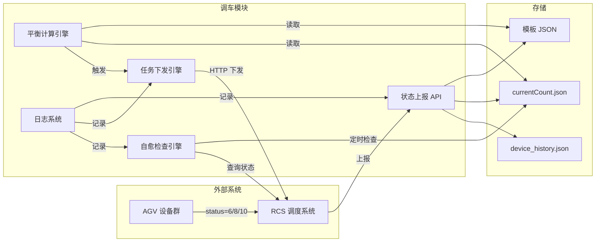

---

## 二、Git 开发时间线

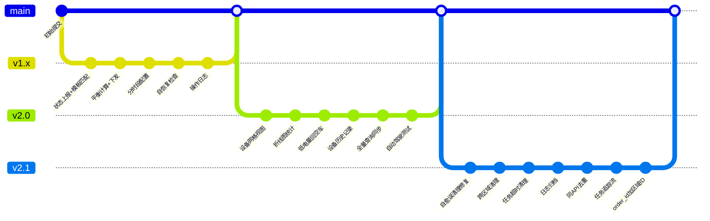

### 版本里程碑

| 版本 | 提交数 | 核心主题 | 代码规模 |
|------|:-----:|---------|:-------:|
| **v1.x** 基础架构 | ~30 | 状态上报、平衡计算、下发、自愈 | ~2000 行 |
| **v2.0** 功能增强 | ~40 | 可视化看板、统计图表、设备追踪 | ~4000 行 |
| **v2.1** 稳定性修复 | ~30 | 误清理修复、去重、日志归档、追踪 | ~4500 行 |

---

## 三、核心技术难题与解决方案

### 难题 1：自愈误清理——连廊环境中的设备被错误移除

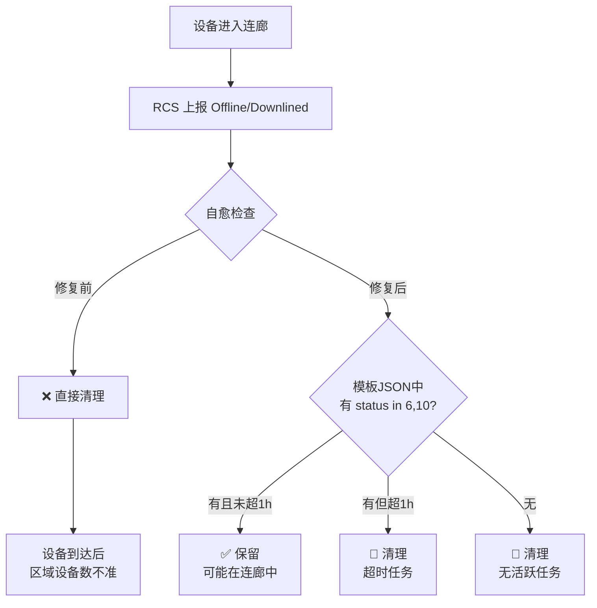

**场景**：AGV 在跨环境连廊中行驶时，RCS 上报状态为 `Offline`/`Downlined`。早期自愈逻辑直接清理，导致设备到达目标区域后 `currentCount` 不准确。

**根因**：`_should_clean_device` 未检查设备是否有执行中任务。

**修复**：遍历该区域所有模板 JSON，查找该设备是否有 `status in (6, 10)` 的任务。有则保留（未超1小时），无则清理。

> 📦 相关提交：`19bcb78` `53d89f9` `5d31183`

---

### 难题 2：全量查询设备暴增——白名单机制过于宽松

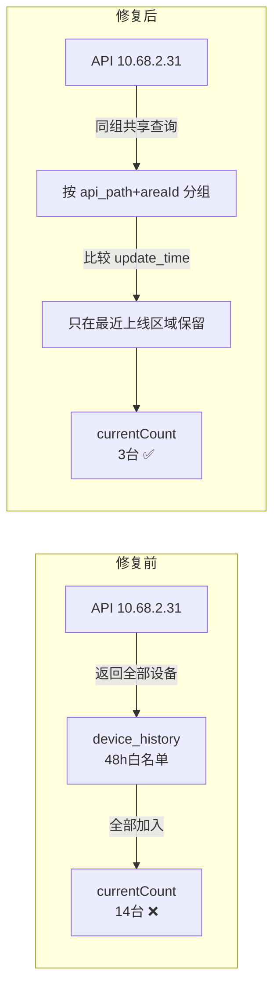

**场景**：A2-3 存储一部的全量查询 API 返回了该服务器下所有设备（包括其他区域的），`device_history.json` 白名单记录了48小时内所有"来过"的设备。全量查询时全部被加入 `currentCount`，从实际的3台暴增到14台。

**根因**：`_update_current_count_from_api` 只检查设备是否在 history 白名单中，不检查最近活动时间。

**修复**：
1. **同 API 区域共享查询**：按 `(api_path, areaId)` 分组，同组只查一次 API
2. **按最近上线区域分配**：比较同组各区域的 `update_time`，只在最新的区域保留设备
3. **离线设备不更新 `update_time`**：48h 后自动清理

> 📦 相关提交：`43260f6` `b9634e7` `7dd2681`

---

### 难题 3：空车回跨区域调车——共享模板导致车走到错误区域

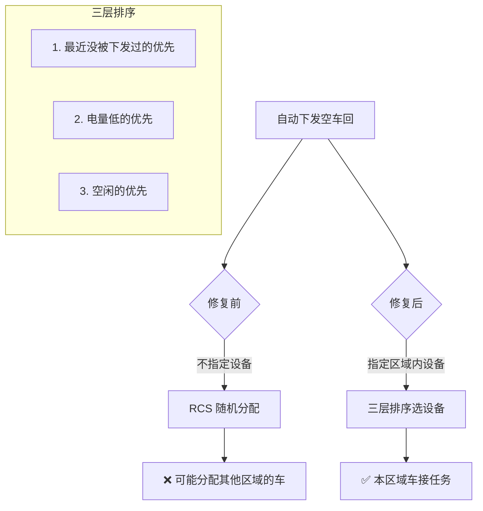

**场景**：两个区域（如 A4-3 行业一部和行业二部）使用共享的空车回模板，自动下发时不指定设备，RCS 可能分配另一个区域的车来执行，导致车走到错误区域。

**修复**：
1. 空车回自动下发时指定区域内设备（`_select_device_for_empty_return`）
2. 三层排序策略：最近没被下发过的优先 → 电量低的优先 → 空闲的优先
3. 下发前检查设备状态，非空闲则跳过
4. **手动下发不指定设备**（异常恢复场景，让 RCS 自行分配更灵活）

> 📦 相关提交：`2d55c7d` `2cd3960` `54f6728`

---

### 难题 4：同一 order_id 重复写入——模板 JSON 残留

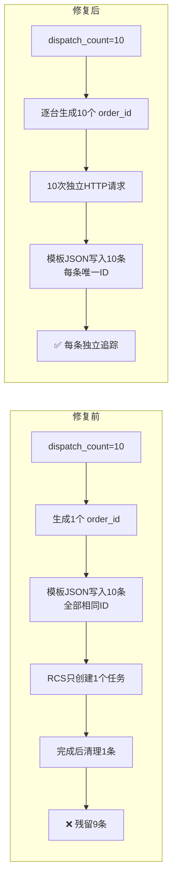

**场景**：`_execute_dispatch` 中 `for i in range(dispatch_count)` 循环写入模板 JSON，所有记录共用同一个 `order_id`。当 `dispatch_count=10` 时，10条记录都是同一个 ID，但 RCS 只创建了1个任务。任务完成后只清理1条，剩余9条永远残留。

**修复**：改为逐台下发——每台独立生成 `order_id`（毫秒时间戳+随机数），独立发送 HTTP 请求，独立写入模板 JSON。

```
修复前: CEM_auto_2026-05-10_11:27:55.235__4502 (10条相同)
修复后: CEM_auto_id4_2026-05-10_11:27:55.235__4502
        CEM_auto_id4_2026-05-10_11:27:55.236__7821
        CEM_auto_id4_2026-05-10_11:27:55.237__3194  ← 每条唯一
```

> 📦 相关提交：`1994ba2` `c9e0a72`

---

### 难题 5：状态上报模板匹配失败——code 名称不一致

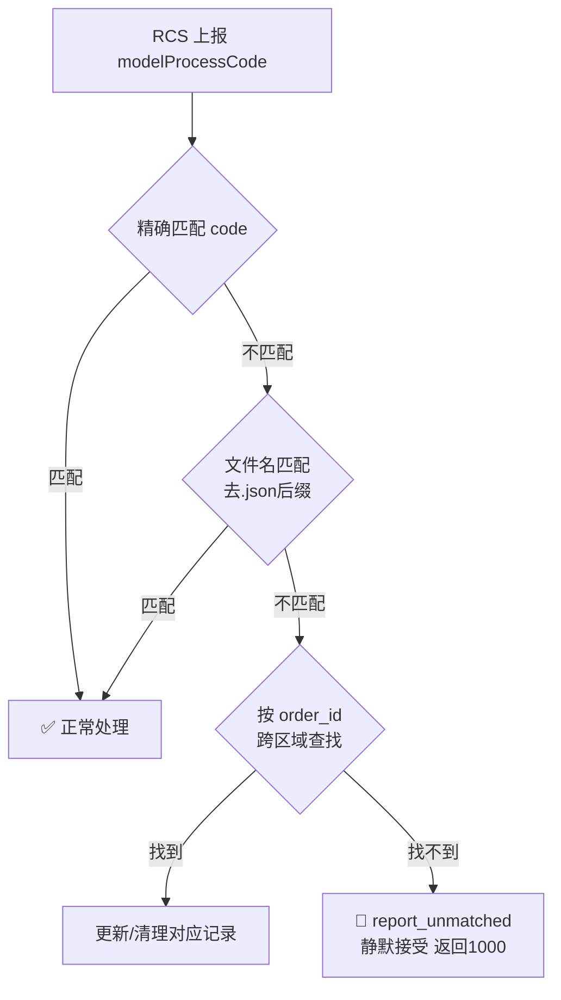

**场景**：RCS 上报的 `modelProcessCode` 是 `JuShengQ27to32-1`，但配置中的模板 code 是 `JuShengQ-1`。精确匹配失败后走 `report_unmatched` 静默接受，导致设备状态未正确更新。

**修复**：三级匹配策略——精确匹配 code → 回退文件名匹配（去 `.json`）→ 按 order_id 跨区域兜底。始终返回 1000 避免 RCS 重试风暴。

> 📦 相关提交：`827f28d` `f28d17b` `cba362e`

---

### 难题 6：日志系统演进——从内存到持久化

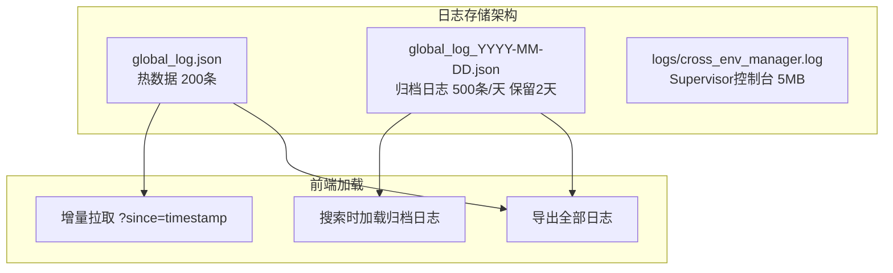

**场景**：早期日志只存在内存中，重启丢失，无法排查历史问题。

**修复**：
1. 热数据 + 归档日志双层存储
2. 前端增量拉取（`?since=timestamp`），缓存400条
3. 搜索时自动加载归档日志，搜索模式下停用自动刷新
4. Supervisor 控制台日志查看 API（`/api/dispatch/logs`）

> 📦 相关提交：`cca03de` `15b979e` `f861f92` `5d31183`

---

### 难题 7：设备网格增量更新——避免全量 DOM 替换

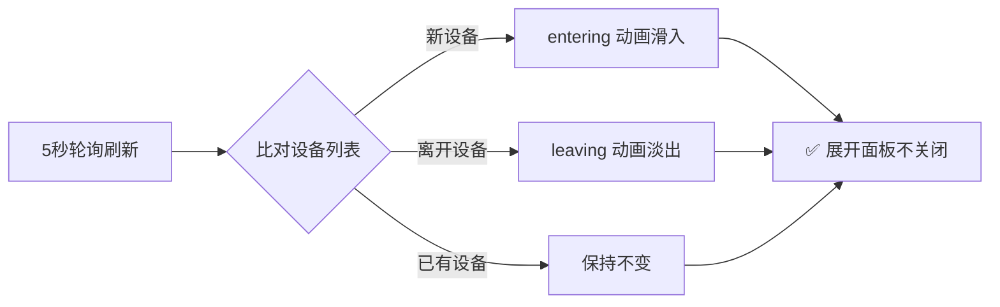

**场景**：看板每5秒刷新时全量替换 HTML，导致展开的 JSON 面板被关闭、动画丢失。

**修复**：比对设备列表差异——新设备带 `entering` 动画滑入，离开的设备带 `leaving` 动画淡出。展开的 JSON 面板和历史设备网格不受影响。

> 📦 相关提交：`b7d3431` `adf1c09`

---

### 难题 8：跨环境子任务 order_id 规范化

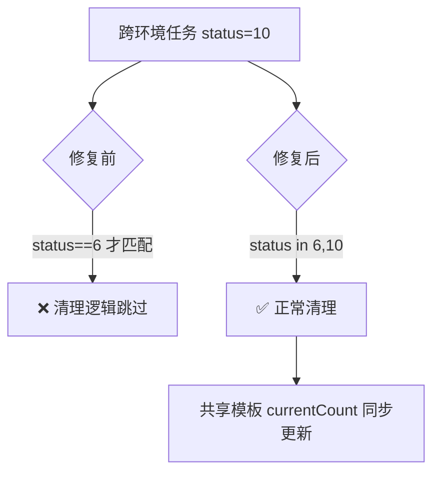

**场景**：跨环境任务（status=10）的 `order_id` 格式与普通任务不同，清理逻辑中 `status == 6` 无法匹配 status=10 的任务。

**修复**：
1. 清理和更新逻辑中 `status == 6` 改为 `status in (6, 10)`
2. status=10 上报时覆盖更新模板 JSON 中的 status 字段
3. 共享模板的 currentCount 同步更新

> 📦 相关提交：`53d89f9` `6a2c8b1` `055a34b`

---

## 四、架构演进

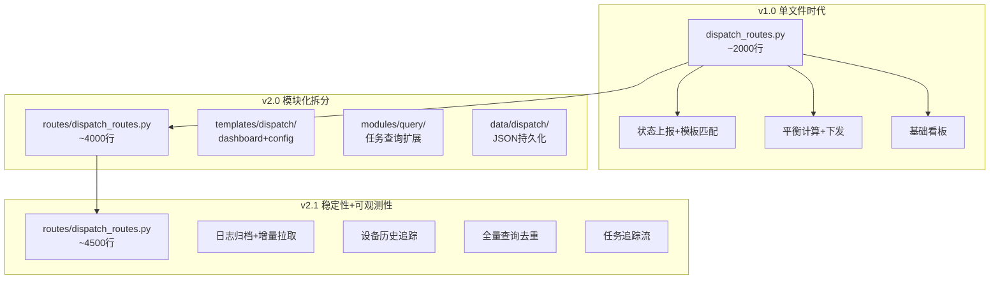

### 数据流全景

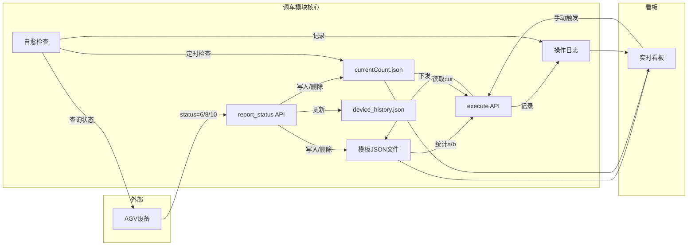

---

## 五、关键文件索引

| 文件 | 行数 | 职责 |
|------|:---:|------|
| `routes/dispatch_routes.py` | ~4500 | 核心调度逻辑、全部 API 接口 |
| `templates/dispatch/dashboard.html` | ~3700 | 实时看板、设备网格、折线图、日志面板 |
| `templates/dispatch/config.html` | ~480 | 可视化配置管理（三标签页） |
| `templates/dispatch/readme.md` | ~700 | 模块完整文档 |
| `templates/dispatch/test.html` | ~490 | 自动驾驶测试（彩蛋功能） |
| `modules/query/task_query_extended.py` | ~800 | 任务查询扩展 |

---

## 六、设计理念

### 零外部依赖
所有数据存储在本地 JSON 文件中，无需数据库服务。在 100 个文件以内性能优于数据库方案（无网络/连接开销）。

### 静默容错
状态上报接口始终返回 `{"code": 1000}`，即使匹配失败也不阻塞 RCS。匹配失败的信息记录到 `report_unmatched` 日志中供排查。

### 增量更新
看板采用增量刷新模式——比对设备列表差异，新设备动画滑入，离开设备动画淡出。展开的面板不受自动刷新影响。

### 防抖保护
自动调度、分时段切换、全量查询均设有防抖机制，避免短时间内重复触发。

### 可观测性
双层日志存储（热数据+归档）、增量拉取、搜索筛选、Supervisor 控制台日志查看，覆盖从开发调试到生产排查的全场景。
