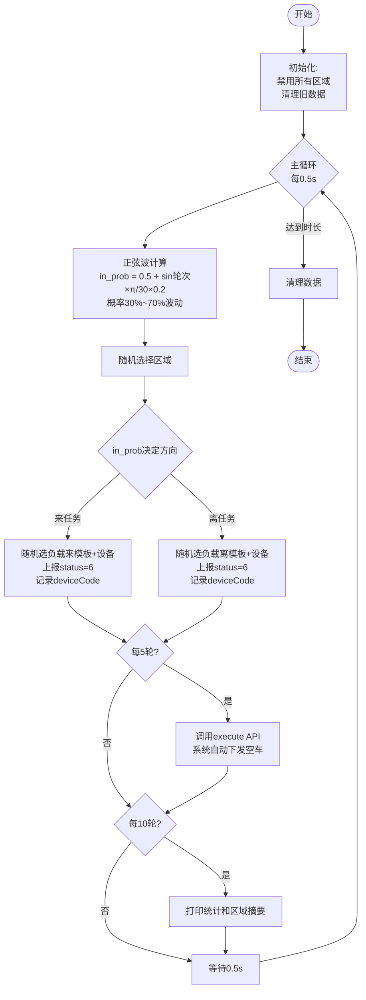
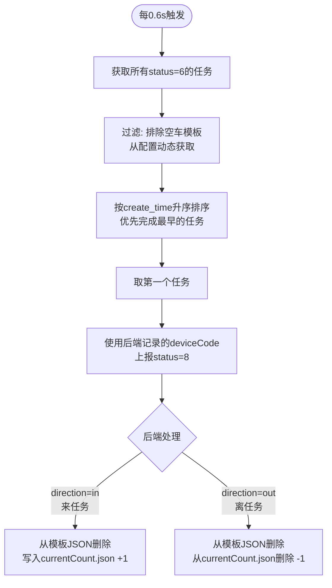
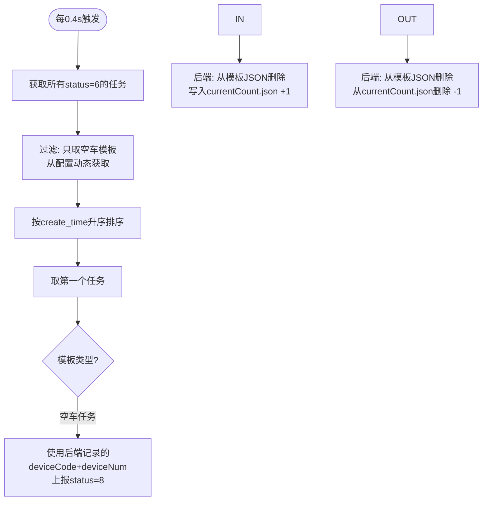
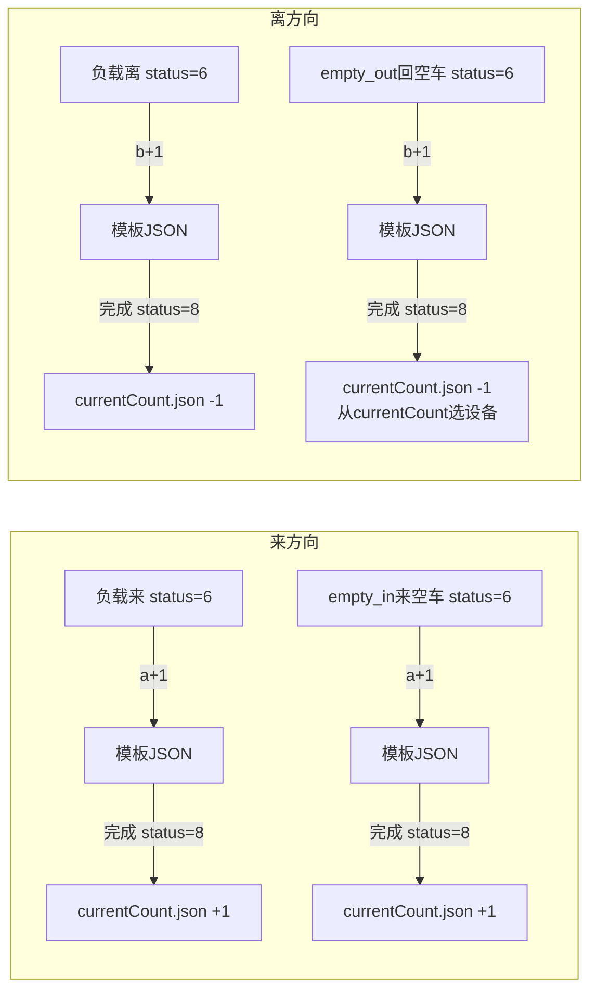
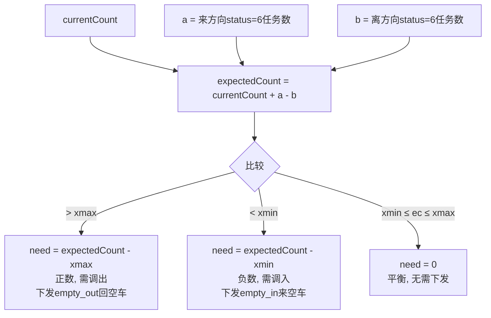

# 调车模块自动驾驶测试 - 模拟逻辑说明

## 整体架构

```mermaid
graph TB
    subgraph 测试脚本
        A[主循环线程<br/>0.5s间隔] -->|上报status=6| API1[/api/dispatch/report_status]
        B[负载完成线程<br/>0.6s间隔] -->|上报status=8| API1
        C[空车完成线程<br/>0.4s间隔] -->|上报status=8| API1
        A -->|每5轮| API2[/api/dispatch/execute]
    end
    subgraph 后端
        API1 -->|写入/删除| JSON[模板JSON文件]
        API1 -->|写入/删除| CC[currentCount.json]
        API2 -->|模拟下发空车| JSON
        API2 -->|记录| LOG[操作日志]
    end
```

## 主循环流程



## 负载任务完成流程



## 空车任务完成流程



## 数据流示意



## 计算公式



## 关键设计决策

| 决策 | 说明 |
|------|------|
| 负载来/离使用相同 deviceCode | 通过 dev_code_map 维护，确保同一设备先来后离时 deviceCode 一致 |
| DKCback 从 currentCount 选设备 | 模拟真实场景：回空车让当前区域中的设备离开 |
| 正弦波模拟高峰/低谷 | 来任务概率在 30%~70% 波动，周期60轮 |
| 空车完成比负载快 | 0.4s vs 0.6s，模拟空车调度更快 |
| 区域禁用模式 | 走模拟下发逻辑，不实际发送HTTP请求 |
